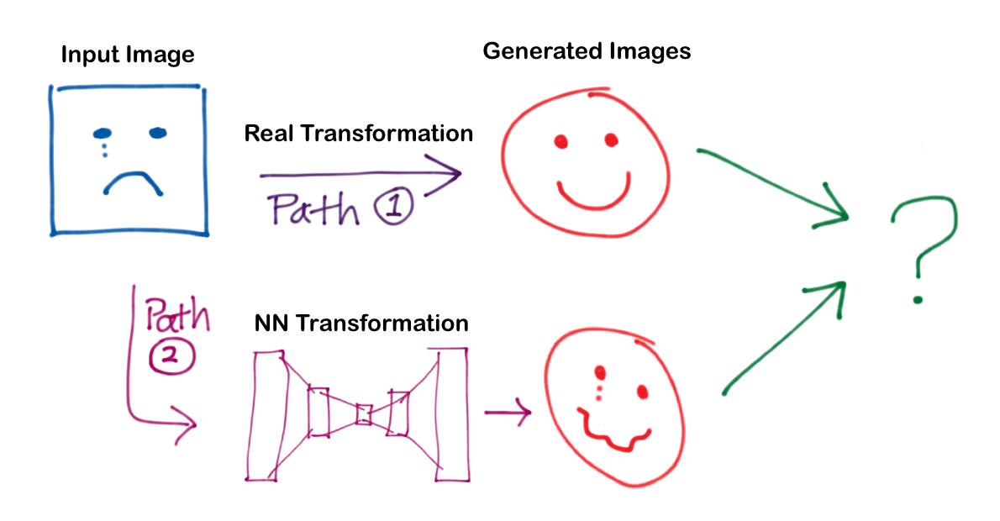

<script src="https://cdn.mathjax.org/mathjax/latest/MathJax.js?config=TeX-AMS-MML_HTMLorMML" type="text/javascript"></script>

<p style="text-align: right"><i>Image credit: Me</i></p>


<div>
<p style="font-style:italic">by <a href="https://drscotthawley.github.io">Scott Hawley</a>, Arpil 26, 2018</p>
    <p style="text-align: left"> 
    <a href="https://github.com/drscotthawley/machinelearningfoundations/blob/master/Ia-FollowingGravity.ipynb">
    Click here</a> to download the <a href="http://jupyter.org">Jupyter</a> notebook file for this document, so you can run the code.
    </p>
</div>

Earlier I wrote a post called [Crash Course on GANs](https://drscotthawley.github.io/Crash-Course-On-GANs/), but somehow in all
of that, I missed the essential essence of [Dev Nang](https://medium.com/@devnag)'s excellent post,
["Generative Adversarial Networks (GANs) in 50 lines of code (PyTorch)"](https://medium.com/@devnag/generative-adversarial-networks-gans-in-50-lines-of-code-pytorch-e81b79659e3f):

 > "GANs are simpler to set up than you think"
 
The figure above shows an image-transformation pipeline. 
In one ‘traditional’ paradigm, the question mark is a loss function such as the Mean Squared Error.
What if instead we replace this loss function with an image classifier, that tries to guess which path the generated image came from, and train the weights of the NN transformation to try to ‘fool’ the classifier?  This amounts to a type of Generative Adversarial Network (GAN).

So, like in the [Portlandia sketch](https://www.youtube.com/watch?v=GNpIOlDhigw), we're going put \[classifiers] on things that didn't have them.


*...And yea, the title for this post should be "Put a Classifier on It (and Turn it Into a GAN)!", but that doesn't flow
as well.*


```python

```
